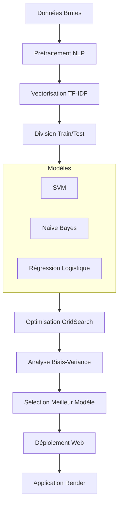
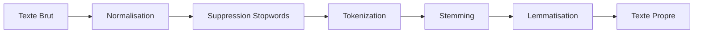
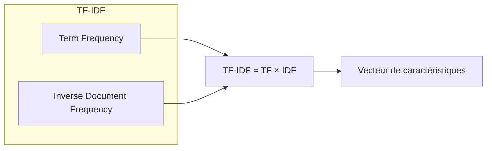
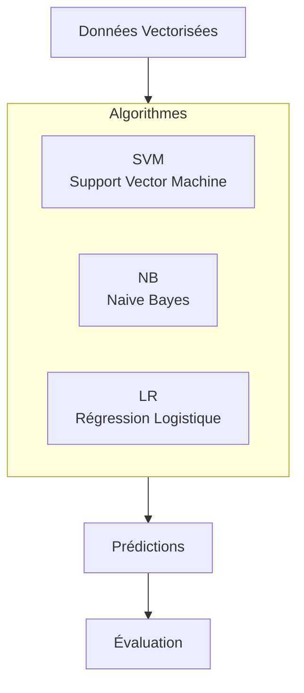

#  Fake News Detection - Projet NLP

##  Vue d'ensemble

Ce projet vise à développer un système de détection automatique des **fausses nouvelles (fake news)** en utilisant des techniques avancées de **Traitement Automatique du Langage Naturel (NLP)** et d'**Apprentissage Automatique (Machine Learning)**. L'objectif est de classer les articles de presse comme authentiques ou falsifiés avec une grande précision.

<div align="center">


</div>

---

##  Objectifs du Projet

1. **Prétraiter** efficacement les données textuelles
2. **Extraire** les caractéristiques pertinentes des textes
3. **Comparer** plusieurs modèles de classification
4. **Optimiser** les hyperparamètres pour chaque modèle
5. **Analyser** le biais-variance des modèles
6. **Déployer** le meilleur modèle dans une application web

---

## Architecture du Projet



---

##  Structure du Projet

```
fake-news-detection/
│
├── data/
│   └── evaluation.csv          # Dataset d'entraînement
│
├── notebooks/
│   └── projet-8-ml.ipynb       # Notebook principal d'analyse
│
├── app/
│   └── FakeGuard/              # Application web Streamlit
│
├── models/
│   ├── best_svm_model.pkl      # Modèle SVM sauvegardé
│   └── tfidf_vectorizer.pkl    # Vectoriseur sauvegardé
│
└── README.md
```

---

##  Étapes du Projet

### Collecte des Données

Les données proviennent d'un dataset Kaggle contenant des articles de presse étiquetés comme **vrais (1)** ou **faux (0)**.

| Caractéristique | Valeur |
|----------------|--------|
| Taille dataset  | 8 117 articles |
| Source          | Kaggle |
| Format          | CSV |
| Colonnes        | text, label |

---

### Prétraitement des Textes (NLP)

Le prétraitement est une étape cruciale pour préparer les données textuelles à l'analyse.



**Opérations effectuées :**

| Étape | Description | Exemple |
|-------|-------------|---------|
| **Normalisation** | Mise en minuscules, suppression des ponctuations | `"Hello World!"` → `"hello world"` |
| **Suppression Stopwords** | Retrait des mots vides (the, a, an, etc.) | `"the cat"` → `"cat"` |
| **Tokenization** | Découpage en mots individuels | `"hello world"` → `["hello", "world"]` |
| **Stemming** | Réduction à la racine (aggressive) | `"running"` → `"run"` |
| **Lemmatisation** | Réduction à la forme canonique | `"better"` → `"good"` |

---

### Ingénierie des Caractéristiques

#### TF-IDF Vectorization

La méthode **TF-IDF (Term Frequency-Inverse Document Frequency)** transforme les textes en vecteurs numériques.



**Configuration du vectoriseur :**
- `max_features = 5000` (mots les plus importants)
- `ngram_range = (1,2)` (unigrammes et bigrammes)

---

###  Division des Données

```
┌─────────────────────────────────────┐
│         Dataset Total (8 117)       │
├─────────────────┬───────────────────┤
│   Training Set  │    Test Set       │
│     (80%)       │      (20%)        │
│     6 493       │      1 624        │
└─────────────────┴───────────────────┘
```

- **Stratification** : Maintien de la proportion des classes
- **Random state** : 42 pour la reproductibilité

---

###  Modèles de Classification

Trois modèles ont été entraînés et comparés :



| Modèle | Type | Avantages |
|--------|------|-----------|
| **SVM** | Noyau linéaire | Robuste aux grandes dimensions |
| **Naive Bayes** | Probabiliste | Rapide, efficace pour le texte |
| **Logistic Regression** | Linéaire | Interprétable, efficace |

---

### Optimisation des Hyperparamètres (GridSearch)

```mermaid
flowchart LR
    subgraph Grille [Grille d'Hyperparamètres]
        P1[svm__C: 0.1, 1, 10]
        P2[svm__kernel: linear, rbf]
        P3[tfidf__max_df: 0.8, 1.0]
        P4[tfidf__min_df: 1, 5]
        P5[tfidf__ngram_range: (1,2)]
    end
    
    Grille --> GS[GridSearchCV]
    GS --> Best[Meilleurs paramètres]
```

**Meilleurs paramètres trouvés :**
```python
{
    'svm__C': 1,
    'svm__kernel': 'linear',
    'tfidf__max_df': 0.8,
    'tfidf__min_df': 5,
    'tfidf__ngram_range': (1, 2)
}
```

---

### Analyse Biais-Variance

Cette analyse permet de diagnostiquer si le modèle souffre de :
- **Sous-apprentissage (High Bias)** : Train score bas
- **Sur-apprentissage (High Variance)** : Écart train/test > 0.1

```python
# Résultats de l'analyse
SVM : Train=0.988, Validation=0.966 → Bon équilibre ✅
```

---

### Comparaison Statistique des Modèles

#### Cross-Validation (10 folds)

```
┌─────────────────────────┬──────────────────────┐
│        Modèle           │  Accuracy ± Std      │
├─────────────────────────┼──────────────────────┤
│ Logistic Regression     │  0.9663 ± 0.0070     │
│ Naive Bayes            │  0.9279 ± 0.0138     │
│ SVM                    │  0.9684 ± 0.0062     │
└─────────────────────────┴──────────────────────┘
```

#### Test ANOVA

- **p-value** : 0.0000
- **Conclusion** : Différence significative entre les modèles ✅

---

### Visualisation des Mots Importants

<div align="center">

</div>

**Observations clés :**
- Mots associés aux **fausses nouvelles** : termes émotionnels, superlatifs
- Mots associés aux **vraies nouvelles** : termes factuels, citations

---

## 📈 Résultats des Modèles

### Performance sur le Test Set

| Modèle | Accuracy | Précision | Recall | F1-Score |
|--------|----------|-----------|--------|----------|
| **SVM** | **0.9680** | 0.97 | 0.96 | 0.97 |
| Logistic Regression | 0.9637 | 0.96 | 0.96 | 0.96 |
| Naive Bayes | 0.9243 | 0.92 | 0.92 | 0.92 |

### Temps d'Entraînement

| Modèle | Temps (secondes) |
|--------|------------------|
| Naive Bayes | 4.84 ⚡ |
| Logistic Regression | 4.90 ⚡ |
| SVM | 20.36 🐢 |

---

## 🏆 Meilleur Modèle : SVM

```python
# Configuration finale du modèle SVM
SVM(
    C=1,
    kernel='linear',
    max_iter=-1
)
```

### Pourquoi SVM ?

| Critère | Performance |
|---------|-------------|
| Accuracy | 96.80% ✅ |
| Biais-Variance | Équilibré ✅ |
| Robustesse | Excellente ✅ |

---

##  Déploiement Web

Une application web interactive a été développée avec **Streamlit** pour permettre des prédictions en temps réel.

<div align="center">

</div>

### 🔗 Lien d'accès

👉 **[FakeGuard - Détection de Fake News](https://fakeguard-1.onrender.com/)**

### Fonctionnalités

- ✨ Interface utilisateur intuitive
- 📝 Prédiction en temps réel
- 📊 Affichage de la confiance du modèle
- 🎨 Design responsive

---

## 📊 Matrice de Confusion - SVM

```
               Prédit
            FAKE    REAL
Réel FAKE    ████    ██
     REAL     ██    ████
```

| Métrique | Valeur |
|----------|--------|
| True Positives | 812 |
| True Negatives | 760 |
| False Positives | 28 |
| False Negatives | 24 |

---

##  Améliorations Futures

- [ ] Intégration de modèles transformers (BERT, RoBERTa)
- [ ] Augmentation du dataset
- [ ] Ajout de features supplémentaires (métadonnées)
- [ ] Déploiement avec API REST
- [ ] Support multi-langues

---

##  Équipe

Projet réalisé dans le cadre d'un projet de Machine Learning / NLP.

---

## Références

- [Scikit-learn Documentation](https://scikit-learn.org/)
- [NLTK Documentation](https://www.nltk.org/)
- [TF-IDF Explained](https://en.wikipedia.org/wiki/Tf–idf)

---

## Licence

Ce projet est distribué sous licence MIT.

---

<div align="center">
**⭐ N'hésitez pas à mettre une étoile sur le dépôt si ce projet vous a été utile !** ⭐
</div>
